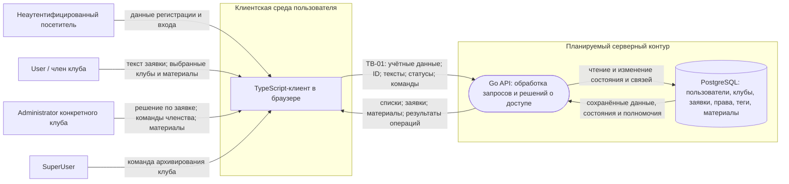

# Модель угроз сервиса клубного членства

Основания: [паспорт проекта](PROJECT.md) и [требования безопасности](SECURITY_REQUIREMENTS.md). Это общая модель S03. Угрозы описывают потенциальные события в планируемом продукте, а не подтверждённые дефекты реализации.

## 1. Модель продукта

**Что уже существует:** согласованный паспорт и требования SR-01–SR-09. На момент объединения модели в этой ветке исходного кода сервера нет.

**Что пока планируется:** TypeScript-клиент, Go API, PostgreSQL, регистрация и вход, операции с клубами, заявками, членством и материалами. Точные маршруты, схема запросов и способ аутентификации ещё не выбраны; имена полей ниже обозначают смысл данных, а не утверждённый API-контракт.

Внешние субъекты: неаутентифицированный посетитель, User, член клуба, Administrator конкретного клуба и SuperUser. Тег `club-member` относится к паре «пользователь — клуб». SuperUser может архивировать клуб, но его роль сама по себе не даёт права читать материалы и заявки или управлять участниками и материалами.

**Существенные допущения:**

- Браузер и отправляемые им идентификаторы, тексты, статусы и команды недоверенны. Пользователь может сформировать прямой запрос в обход интерфейса; ID объекта может стать ему известен.
- API устанавливает действующего субъекта и решает допустимость операции. Сам факт входа не подтверждает право на конкретный объект.
- PostgreSQL хранит состояние клубов, связей и прав; прямого доступа пользователей к базе в планируемой модели нет. Это допущение о доступе к хранилищу, а не гарантия корректности всех сохранённых данных.
- Удаление клуба означает архивирование. Материалы, заявки, теги и права сохраняются, но прежние полномочия перестают давать доступ к материалам и управлению клубом.
- Название и описание активного клуба публичны; закрытым активом являются его материалы, а не название.
- Оплата, внешние провайдеры, уведомления и загрузка файлов не входят в рассматриваемую версию. Самостоятельного журнала всех действий и восстановления архива в интерфейсе пока нет.

### Архитектурный вид

### Точки входа и потоки

| ID | Операция и входные данные | Значимый результат |
| --- | --- | --- |
| EP-01 | Регистрация и вход: учётные данные, данные регистрации, контекст входа | Учётная запись и установление действующего пользователя |
| EP-02 | Создание клуба: название, описание; возможные лишние ID в прямом запросе | Новый клуб, право администратора и членство создателя |
| EP-03 | Создание и просмотр заявки: ID клуба/заявки, текст; возможные подменённые владелец и статус | Новая заявка либо возврат её содержания и статуса |
| EP-04 | Рассмотрение заявки: ID заявки, решение approved/rejected | Статус, автор и время решения; членство при одобрении |
| EP-05 | Управление членством: пользователь, клуб, действие | Добавление или удаление club-member конкретного клуба |
| EP-06 | Работа с материалами: ID клуба/материала, содержимое | Чтение, создание или изменение материала |
| EP-07 | Архивирование: ID клуба и команда удаления | Архивное состояние клуба, прекращение прежнего доступа |
| EP-08 | Профиль и списки: выбранные объекты, параметры запроса | Публичный список клубов и личные сведения пользователя |

## 2. Границы доверия

| Граница | Что пересекает | Почему требуется проверка |
| --- | --- | --- |
| TB-01: браузер → Go API | Учётные данные, контекст входа, ID объектов, тексты, статусы и команды | Клиент управляет запросом; скрытая кнопка, корректный формат ID и факт входа не доказывают допустимость операции |
| TB-02: установленный пользователь → операция с дополнительным полномочием | ID целевого клуба/объекта и команда управления либо архивирования | Внутри одного API меняется требуемое полномочие: пользователь не получает права Administrator любого клуба или SuperUser только из-за входа |

TB-02 — логическая граница полномочий, а не дополнительный сервис или сеть. Взаимодействие API с PostgreSQL показано на схеме; отдельная граница доступа к базе потребует уточнения после выбора развёртывания, пользователей БД и внешних подключений.

## 3. Значимые объекты и свойства

Подробные последствия описаны в [разделе 5 паспорта](PROJECT.md#5-значимые-данные-и-объекты). Для обхода потоков важны:

- идентичность пользователя и глобальная роль — подлинность субъекта и целостность полномочий;
- право администратора и тег club-member конкретного клуба — целостность связи «пользователь — клуб»;
- заявка — конфиденциальность содержания, целостность владельца, статуса и сведений о решении;
- материал — конфиденциальность, целостность содержимого и принадлежности клубу;
- состояние клуба — целостность, доступность законных функций и прекращение доступа после архивирования.

## 4. Угрозы

Использована рабочая форма L03: субъект или условие → действие → объект → нарушаемое свойство → последствие. STRIDE служит вопросником для обхода потоков; отдельная запись на каждую категорию не создаётся. Сбои также могут быть источником угрозы.

Для релевантных сценариев применяется относительный приоритет: **высокий**, если простой запрос или обычное изменение состояния может раскрыть закрытые данные, изменить полномочия или лишить клуб работы; **средний**, если последствия более локальны и не дают прямого доступа к существующему чужому клубу. Дополнительное условие само по себе не делает угрозу менее важной. Кандидат получает приоритет после проверки применимости. Выбранный набор перечислен один раз в разделе 5.

### T-01 — Чтение материалов чужого клуба по идентификатору

**Сценарий:** вошедший пользователь имеет club-member клуба «Кино», но не клуба «Музыка». Он подставляет ID «Музыки» или её материала в запрос списка либо отдельного материала. Если API проверяет только вход или членство в любом клубе, закрытое содержимое возвращается постороннему. Вариант: SuperUser без членства получает материал только из-за глобальной роли.

- **Объект и нарушение:** закрытый материал; конфиденциальность и соблюдение полномочий.
- **Граница / вход:** TB-01, EP-06; API читает материал, его клуб и членство из PostgreSQL.
- **Связанные SR:** [SR-01](SECURITY_REQUIREMENTS.md).
- **Статус:** релевантна — чтение входит в основной сценарий, запрос контролируется клиентом.
- **Приоритет:** высокий — обычного прямого запроса достаточно для раскрытия закрытого содержимого; знание ID не считается правом доступа.
- **Пересмотр:** если материалы станут публичными или изменится модель доступа.

### T-02 — Просмотр чужой заявки по идентификатору

**Сценарий:** User запрашивает чужую заявку, Administrator — заявку другого клуба, либо SuperUser — заявку без права просмотра. API возвращает её содержание или статус, хотя субъект не является допустимым получателем.

- **Объект и нарушение:** содержание и статус заявки; конфиденциальность и соблюдение полномочий.
- **Граница / вход:** TB-01, EP-03, хранилище заявок.
- **Связанные SR:** [SR-02](SECURITY_REQUIREMENTS.md).
- **Статус:** релевантна — просмотр заявок предусмотрен, ID поступает от клиента.
- **Приоритет:** средний — при текущем описании раскрывается отдельная заявка, без выдачи членства. При появлении особо чувствительных данных или массовой выгрузки приоритет нужно пересмотреть.
- **Пересмотр:** изменение чувствительности содержания, области выдачи или круга получателей.

### T-03 — Несанкционированное удаление клуба

**Сценарий:** User или Administrator напрямую отправляет команду удаления клуба. API принимает факт входа или клубное право администратора за полномочие SuperUser и архивирует клуб. Участники теряют доступ к его обычным функциям и материалам.

- **Объект и нарушение:** активное состояние клуба; целостность, доступность и соблюдение полномочий.
- **Граница / вход:** TB-01, TB-02, EP-07, изменение состояния в PostgreSQL.
- **Связанные SR:** [SR-03](SECURITY_REQUIREMENTS.md).
- **Статус:** релевантна — архивирование входит в продукт, команду можно отправить в обход интерфейса.
- **Приоритет:** высокий — один запрос прекращает работу клуба для всех его участников.
- **Пересмотр:** изменение полномочия удаления или семантики архивирования.

### T-04 — Сохранение прежних прав после удаления клуба

**Сценарий:** SuperUser архивирует клуб. Бывший участник запрашивает его материал по старому ID, а прежний администратор отправляет команду управления. Если API принимает сохранившийся тег или право без учёта архивного состояния, данные возвращаются либо изменяются вопреки прекращению доступа.

- **Объект и нарушение:** материалы и управляемое состояние архивного клуба; конфиденциальность, целостность и соблюдение полномочий.
- **Граница / вход:** TB-01, для управления также TB-02; EP-03–EP-06; клуб, теги и права в PostgreSQL.
- **Связанные SR:** [SR-03, SR-01, SR-04, SR-05, SR-06](SECURITY_REQUIREMENTS.md).
- **Статус:** релевантна — сохранение записей после удаления прямо предусмотрено паспортом.
- **Приоритет:** высокий — архивирование является штатным событием, а сохранённые права создают реалистичный путь продолжения доступа. Его редкость и наличие достаточной альтернативной защиты не установлены.
- **Пересмотр:** физическое удаление, изоляция архивных данных или изменение правил доступа к архиву.

### T-05 — Решение по чужой или уже закрытой заявке

**Сценарий:** Administrator клуба A отправляет решение для заявки клуба B; ту же операцию пытается выполнить User или SuperUser. Другой вариант: повторное решение по уже обработанной заявке принимается как новое. Членство выдаётся без полномочия либо прежнее решение, автор и время перезаписываются.

- **Объект и нарушение:** заявка, сведения о решении и членство; целостность и соблюдение полномочий.
- **Граница / вход:** TB-01, TB-02, EP-04; заявка и теги в PostgreSQL.
- **Связанные SR:** [SR-04](SECURITY_REQUIREMENTS.md).
- **Статус:** релевантна — принятие решения по ID меняет право доступа; окончательный контракт конкурентных запросов пока не определён.
- **Приоритет:** высокий — одобрение непосредственно выдаёт доступ к закрытым материалам.
- **Пересмотр:** изменение жизненного цикла заявки или способа выдачи членства.

### T-06 — Изменение членства чужого клуба

**Сценарий:** Administrator клуба A подставляет ID клуба B или записи его членства и добавляет либо удаляет club-member. User или SuperUser также может попытаться напрямую вызвать эту операцию. Посторонний получает доступ к материалам B либо законный участник теряет его.

- **Объект и нарушение:** тег для пары «пользователь — клуб»; целостность полномочий, вслед за ней конфиденциальность или доступность материалов.
- **Граница / вход:** TB-01, TB-02, EP-05, хранилище тегов.
- **Связанные SR:** [SR-05](SECURITY_REQUIREMENTS.md).
- **Статус:** релевантна — управление членством входит в основные функции, целевые объекты выбираются по ID.
- **Приоритет:** высокий — изменение тега непосредственно меняет разрешение на чтение материалов.
- **Пересмотр:** изменение способа управления членством или модели доступа.

### T-07 — Изменение материала чужого клуба

**Сценарий:** Administrator клуба A подставляет ID клуба B или его материала и создаёт либо изменяет содержимое от имени B. Прямую операцию также пытается выполнить User или SuperUser без соответствующего клубного полномочия. Участники B получают подменённые материалы.

- **Объект и нарушение:** содержимое и принадлежность материала; целостность и соблюдение полномочий.
- **Граница / вход:** TB-01, TB-02, EP-06, хранилище материалов.
- **Связанные SR:** [SR-06](SECURITY_REQUIREMENTS.md).
- **Статус:** релевантна — создание и изменение материалов предусмотрены паспортом.
- **Приоритет:** высокий — подмена затрагивает достоверность содержимого для участников клуба. История изменений и гарантированное восстановление не предусмотрены; факт входа и знание ID не снижают этот ущерб.
- **Пересмотр:** неизменяемость материалов, наличие подтверждённого восстановления или иной контур управления.

### T-08 — Подмена получателя прав при создании клуба

**Сценарий:** вошедший пользователь передаёт чужой ID как получателя права администратора или club-member. Если API использует его вместо текущего пользователя, права нового клуба назначаются другому аккаунту, а создатель может остаться без управления и доступа.

- **Объект и нарушение:** право администратора и членство нового клуба; целостность связей и соблюдение полномочий.
- **Граница / вход:** TB-01, EP-02; создание клуба, права и тега в PostgreSQL.
- **Связанные SR:** [SR-07](SECURITY_REQUIREMENTS.md).
- **Статус:** релевантна — создание клуба включает назначение двух связанных полномочий.
- **Приоритет:** средний — последствия ограничены новым клубом и его первоначальными правами; захват существующего чужого клуба здесь не предполагается.
- **Пересмотр:** если создание клуба начнёт принимать отдельный ID для назначения прав, проверить риск привязки к существующему чужому клубу.

### T-09 — Заявка с подменённым владельцем, статусом или клубом

**Сценарий:** при создании заявки пользователь передаёт чужой ID владельца, начальный статус approved/rejected либо ID архивного клуба. Если API принимает эти поля, появляется заявка от имени другого человека, ложная запись о решении либо новая заявка в неактивном клубе.

- **Объект и нарушение:** владелец, начальный статус и клуб заявки; подлинность автора и целостность состояния.
- **Граница / вход:** TB-01, EP-03, заявки и состояние клуба в PostgreSQL.
- **Связанные SR:** [SR-08](SECURITY_REQUIREMENTS.md). Нарушенный порядок рассмотрения затрагивает SR-04, архивное состояние задано SR-03.
- **Статус:** релевантна — все три варианта относятся к одной операции и свойству SR-08; при реализации каждый вариант нужно рассмотреть отдельно.
- **Приоритет:** средний — сама запись статуса approved по текущим правилам ещё не выдаёт тег: выдача определена при решении администратора. При автоматической выдаче членства из начального статуса приоритет станет высоким.
- **Пересмотр:** изменение обработки начального статуса, выдачи членства или операций с архивом. Восстановление клуба в интерфейсе не предполагается.

### T-10 — Подмена действующего пользователя или глобальной роли

**Сценарий:** посетитель или User передаёт чужой user_id, привилегированную роль либо непроверенный контекст входа. Если API принимает их за установленную личность и полномочия, запрос выполняется от имени другого пользователя, Administrator или SuperUser: становятся доступны чужие данные и команды управления.

- **Объект и нарушение:** идентичность субъекта и его полномочия; подлинность, конфиденциальность, целостность и доступность.
- **Граница / вход:** TB-01; EP-01 и операции, требующие входа; при управлении также TB-02.
- **Связанные SR:** [SR-09](SECURITY_REQUIREMENTS.md). Угроза была выявлена при S03 и привела к добавлению требования об установлении действующего пользователя; SR-01–SR-08 опираются на это свойство при проверке конкретных операций.
- **Статус:** релевантна — вход и роли входят в продукт; сценарий не предполагает взлом выбранного криптографического механизма, который пока не определён.
- **Приоритет:** высокий — подмена субъекта разрушает основание остальных проверок доступа.
- **Пересмотр:** выбор и проверка способа аутентификации, источника ролей и обработки контекста входа.

## 5. Приоритетный набор

Для проектных решений S04 выбраны **T-01, T-04, T-05, T-06 и T-10**. Эти сценарии представляют разные пути нарушения: чтение материала другого клуба, сохранение доступа к архиву, незаконное решение по заявке, изменение членства и подмену действующего субъекта. Выбор объясняется реалистичностью прямого запроса, влиянием на основные сценарии и возможностью раскрыть материалы либо изменить право доступа.

Другие релевантные угрозы остаются в модели. T-03 (архивирование без SuperUser) и T-07 (изменение чужого материала) также имеют высокий приоритет по последствиям, но при выборе D нужно рассмотреть их вместе с T-10 и T-06: в обоих случаях проверяется полномочие субъекта на конкретное действие и объект. T-02, T-08 и T-09 имеют средний приоритет при текущих допущениях. При изменении реализации или последствий состав набора пересматривается. Один D может относиться к нескольким T и SR; отдельный механизм на каждую угрозу не требуется.

## 6. Вопросы к S04 и следующему обновлению модели

- **T-10 и SR-09:** при выборе способа входа уточнить, откуда API получает личность и роль действующего пользователя. Проверить, что данные о целевом пользователе в разрешённых административных действиях не подменяют действующего субъекта. Окончательный механизм и будущая проверка будут описаны в D на S04.
- **Создание клуба:** после выбора API-контракта выяснить, может ли клиент влиять на ID клуба, к которому привязываются права и тег. Сценарий из исходной части команды о выдаче прав в существующем чужом клубе пока не включён: такого входного поля в паспорте нет. Если путь обнаружится, добавить самостоятельную угрозу с новым ID и пересмотреть T-08. Отдельно проверить, что сбой при создании клуба не оставляет частично назначенные право и тег; это рассмотрено в материалах команды, но не входит в выбранное ядро из десяти угроз.
- **Заявки:** паспорт предусматривает одну ожидающую заявку пользователя в клуб. Решить, создают ли дубли от повторных или одновременных запросов значимый риск безопасности либо это только предметное правило. Проверить также согласованность решения по заявке и выдачи членства при сбое или одновременных решениях.
- **Изменение продукта:** при появлении работающего API сверить фактические точки входа, аутентификацию, обработку текста материалов и заявок, состояние архива и правила развёртывания с этой моделью. Если чужой текст отображается как активное содержимое браузера, рассмотреть отдельный сценарий выполнения чужих команд в контексте пользователя. Новые подтверждённые пути получают новые ID, прежние ID не переиспользуются.

Здесь зафиксированы угрозы и последствия. Проектные решения D, будущие проверки и фактически полученные свидетельства оформляются на следующих этапах.
