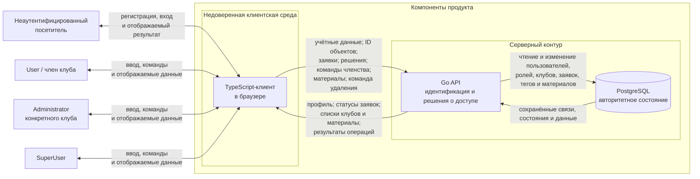

# Модель угроз сервиса клубного членства

Документ описывает модель угроз для текущей планируемой версии сервиса. Основанием служат [паспорт проекта](PROJECT.md) и [требования безопасности](SECURITY_REQUIREMENTS.md).

Модель фиксирует архитектуру, границу доверия, релевантные угрозы и их связи с `SR-*`. Проектные решения `D-*`, защитные механизмы и будущие проверки относятся к следующему этапу и здесь не выбираются.

## 1. Контекст и границы анализа

В границу продукта входят браузерный TypeScript-клиент, Go API, структура данных PostgreSQL и логика работы с пользователями, клубами, заявками, членством и материалами.

В модели рассматриваются следующие внешние субъекты:

- неаутентифицированный посетитель;
- обычный пользователь и член клуба;
- администратор конкретного клуба;
- единственный SuperUser платформы.

Роли и теги различаются: Administrator связан с конкретным клубом, а `club-member` является тегом членства для пары «пользователь — клуб». Роль SuperUser сама по себе не предоставляет доступ к заявкам, членству или материалам клуба.

Существенные допущения текущей версии:

- архитектура пока планируемая и основана на согласованном паспорте проекта;
- браузер и все полученные от клиента значения считаются недоверенными;
- Go API является компонентом, который должен устанавливать текущего пользователя и принимать решения о допустимости операций;
- PostgreSQL хранит авторитетное состояние пользователей, ролей, клубов, заявок, тегов и материалов;
- удаление клуба является логическим архивированием: связанные записи сохраняются, но не должны участвовать в выдаче доступа;
- конкретный механизм аутентификации и формат сессии ещё не выбраны.

Оплата, внешняя проверка личности, уведомления, мобильное приложение и другие исключённые из паспорта функции в модели не рассматриваются.

## 2. Архитектурный вид

### 2.1. Компоненты и ответственность

| Элемент | Назначение | Решения, значимые для модели |
| --- | --- | --- |
| Браузер и TypeScript-клиент | Показывает формы и отправляет команды пользователя | Не является источником доверенных ролей, идентификаторов пользователя или статусов |
| Go API | Обрабатывает все пользовательские и административные операции | Определяет текущего субъекта, область его полномочий, состояние клуба и допустимость операции |
| PostgreSQL | Хранит состояние продукта | Содержит пользователей, глобальные роли, права администраторов, клубы, заявки, теги и материалы |

### 2.2. Точки входа и изменения состояния

| ID | Точка входа | Недоверенные данные или команда | Возможное изменение или раскрытие | Решение принимает |
| --- | --- | --- | --- | --- |
| `EP-01` | Регистрация и вход | Учётные данные и данные регистрации | Создание пользователя и контекста входа | Go API |
| `EP-02` | Создание клуба | Название, описание и возможные лишние или подменённые ID прямого запроса | Клуб, право Administrator и тег `club-member` | Go API |
| `EP-03` | Создание и просмотр заявки | `club_id`, текст, `application_id`, возможные лишние или подменённые `user_id` и `status` | Новая заявка либо раскрытие существующей | Go API |
| `EP-04` | Рассмотрение заявки | `application_id`, решение `approved` или `rejected` | Статус заявки и, при одобрении, членство | Go API |
| `EP-05` | Управление членством | `user_id`, `club_id` или ID записи членства, действие | Добавление или удаление `club-member` | Go API |
| `EP-06` | Работа с материалами | `club_id`, `material_id`, содержимое материала | Чтение, создание или изменение материала | Go API |
| `EP-07` | Удаление клуба | `club_id` | Архивное состояние клуба и прекращение доступа | Go API |
| `EP-08` | Профиль и списки | Идентификаторы выбранных объектов и параметры запроса | Раскрытие списка клубов, заявок и доступных данных | Go API |

## 3. Граница доверия и недоверенный ввод

### TB-01 — браузерный клиент → Go API

Граница отделяет среду пользователя от серверной части продукта. Через неё проходят учётные данные, идентификаторы пользователей, клубов, заявок и материалов, тексты, статусы и команды изменения состояния.

Запрос нельзя считать допустимым только потому, что он отправлен через штатный интерфейс или от вошедшего пользователя. Клиент может изменить URL, JSON, скрытое поле или повторить прямой запрос. Поэтому переданные клиентом `user_id`, роль, `club_id`, `application_id`, `material_id`, статус и тип операции являются недоверенным вводом.

Роли User, Administrator и SuperUser не образуют отдельные технические компоненты. Различие их полномочий проверяется в угрозах, связанных с конкретными точками входа и объектами.

PostgreSQL не выделяется как самостоятельная граница доверия: текущие материалы проекта не задают отдельного администратора базы или иной уровень ответственности. Это решение следует пересмотреть, если способ развёртывания или управления хранилищем изменится.

## 4. Значимые активы и свойства

| Актив | Значимые свойства |
| --- | --- |
| Идентичность пользователя и глобальная роль | Подлинность субъекта, целостность роли |
| Право Administrator для пары «пользователь — клуб» | Целостность и соблюдение области полномочий |
| Тег `club-member` для пары «пользователь — клуб» | Целостность и корректность предоставленного доступа |
| Заявка и её состояние | Конфиденциальность содержания, целостность владельца, клуба, статуса и решения |
| Материалы клуба | Конфиденциальность и целостность содержимого и принадлежности клубу |
| Активное или архивное состояние клуба | Целостность, доступность и прекращение прежних прав после удаления |

## 5. Подход к выявлению и приоритизации

Угроза формулируется по схеме:

> кто или что → действие или условие → затронутый объект → нарушаемое свойство → последствие

STRIDE использован только как вопросник для проверки возможных подмены субъекта, изменения данных, раскрытия, отказа в обслуживании и повышения полномочий. Категории STRIDE не заменяют предметные сценарии и не задают структуру документа.

Используется относительная шкала:

- **высокий приоритет** — реалистичный путь затрагивает основное защитное свойство, выдаёт полномочие или влияет на многих пользователей;
- **средний приоритет** — сценарий реалистичен и значим, но имеет более узкий охват или дополнительное условие;
- **низкий приоритет** — последствия ограничены либо в продукте сохраняется простой альтернативный путь. В текущем наборе таких угроз нет.

## 6. Релевантные угрозы

### T-01 — Чтение материалов чужого клуба по идентификатору

**Формулировка:** аутентифицированный пользователь без `club-member` выбранного активного клуба, включая участника другого клуба или SuperUser, подставляет `club_id` или `material_id` в прямом запросе и получает закрытый материал.

- **Субъект или условие:** пользователь без членства в выбранном клубе.
- **Элемент модели / точка входа:** `TB-01`, `EP-06`, Go API, данные материалов и тегов.
- **Актив:** закрытые материалы клуба и корректность решения о доступе.
- **Нарушаемое свойство:** конфиденциальность и соблюдение полномочий.
- **Последствие:** содержимое клуба раскрывается постороннему пользователю.
- **Статус:** релевантна; идентификаторы поступают из недоверенного клиента, а чтение материалов входит в основной сценарий.
- **Приоритет:** высокий; одного успешного запроса достаточно для раскрытия закрытых данных.
- **Связанные требования:** `SR-01`.
- **Условие пересмотра:** материалы становятся публичными либо изменяется модель членства или выдачи материалов.

### T-02 — Просмотр чужой заявки по идентификатору

**Формулировка:** обычный пользователь, администратор другого клуба или SuperUser подставляет `application_id` и получает содержание или статус заявки, которую ему нельзя просматривать.

- **Субъект или условие:** субъект без права просмотра конкретной заявки.
- **Элемент модели / точка входа:** `TB-01`, `EP-03`, Go API, хранилище заявок.
- **Актив:** текст заявки, её статус и сведения о кандидате.
- **Нарушаемое свойство:** конфиденциальность и соблюдение полномочий.
- **Последствие:** сведения кандидата раскрываются постороннему человеку.
- **Статус:** релевантна; просмотр заявок существует, а их ID поступает от клиента.
- **Приоритет:** средний; прямой запрос реалистичен, но ущерб уже, чем выдача членства или раскрытие материалов клуба.
- **Связанные требования:** `SR-02`.
- **Условие пересмотра:** заявки становятся публичными или обезличенными либо изменяется круг их получателей.

### T-03 — Несанкционированное удаление клуба

**Формулировка:** обычный пользователь или администратор клуба отправляет прямую команду удаления с выбранным `club_id`, после чего активный клуб архивируется без полномочий SuperUser.

- **Субъект или условие:** User либо Administrator без глобальной роли SuperUser.
- **Элемент модели / точка входа:** `TB-01`, `EP-07`, Go API, состояние клуба.
- **Актив:** активное состояние клуба и доступность его функций и данных.
- **Нарушаемое свойство:** соблюдение полномочий, целостность и доступность.
- **Последствие:** клуб исчезает для всех участников, а его обычная работа прекращается.
- **Статус:** релевантна; `club_id` и команда приходят с клиентской стороны, а удаление входит в продукт.
- **Приоритет:** высокий; один запрос может затронуть всех участников и все данные клуба.
- **Связанные требования:** `SR-03`.
- **Условие пересмотра:** изменяется субъект, уполномоченный управлять жизненным циклом клуба, или модель удаления.

### T-04 — Сохранение прежних прав после удаления клуба

**Формулировка:** бывший участник или администратор удалённого клуба напрямую обращается к его материалам или функциям управления, а сохранённый архивный тег либо право Administrator продолжает приниматься как действующее полномочие.

- **Субъект или условие:** пользователь с прежним тегом или правом удалённого клуба.
- **Элемент модели / точка входа:** `TB-01`, `EP-03`–`EP-06`, Go API, архивное состояние клуба, теги и права.
- **Актив:** материалы, заявки, членство, права администратора и семантика архивирования.
- **Нарушаемое свойство:** конфиденциальность, целостность и соблюдение полномочий.
- **Последствие:** данные удалённого клуба остаются доступны или изменяются вопреки правилу прекращения доступа.
- **Статус:** релевантна; связанные записи намеренно сохраняются после удаления.
- **Приоритет:** средний; последствия охватывают несколько правил доступа, но сценарий требует предварительно удалённого клуба.
- **Связанные требования:** `SR-03`; дополнительно затрагиваются `SR-01`, `SR-04`, `SR-05` и `SR-06`.
- **Условие пересмотра:** связанные данные удаляются физически, изолируются отдельным контуром либо меняется архивная модель.

### T-05 — Решение по чужой или уже закрытой заявке

**Формулировка:** администратор клуба A отправляет решение `approved` или `rejected` для заявки, которую он не вправе рассматривать: заявки клуба B либо заявки, которая уже не имеет статус `pending`.

- **Субъект или условие:** администратор без полномочий в клубе заявки либо повторная операция над закрытой заявкой.
- **Элемент модели / точка входа:** `TB-01`, `EP-04`, Go API, заявка и тег членства.
- **Актив:** статус заявки, членство заявителя, автор и время решения.
- **Нарушаемое свойство:** соблюдение полномочий и целостность статуса и сведений о решении.
- **Последствие:** посторонний получает членство, заявителю ошибочно отказывают либо прежнее решение перезаписывается.
- **Статус:** релевантна; администраторы работают с ID заявок, а одобрение меняет право доступа.
- **Приоритет:** высокий; результат `approved` непосредственно создаёт доступ к закрытым материалам.
- **Связанные требования:** `SR-04`.
- **Условие пересмотра:** изменяется жизненный цикл заявки или способ выдачи членства.

### T-06 — Изменение членства чужого клуба

**Формулировка:** администратор клуба A подменяет `club_id`, `user_id` или ID записи членства и добавляет либо удаляет `club-member` клуба B; ту же операцию напрямую пытается выполнить User или SuperUser.

- **Субъект или условие:** субъект без права управления членством выбранного клуба.
- **Элемент модели / точка входа:** `TB-01`, `EP-05`, Go API, хранилище тегов.
- **Актив:** тег членства для пары «пользователь — клуб» и основанный на нём доступ.
- **Нарушаемое свойство:** соблюдение полномочий и целостность; как следствие — конфиденциальность или доступность материалов.
- **Последствие:** посторонний получает доступ к закрытым материалам либо законный участник его теряет.
- **Статус:** релевантна; операция входит в основные функции администратора, а идентификаторы приходят от клиента.
- **Приоритет:** высокий; это прямое изменение разрешения, от которого зависит чтение материалов.
- **Связанные требования:** `SR-05`; последующее чтение материалов является последствием неверно выданного членства.
- **Условие пересмотра:** членство перестаёт изменяться администраторами либо заменяется модель доступа.

### T-07 — Изменение материала чужого клуба

**Формулировка:** администратор клуба A либо иной субъект без соответствующего права подставляет `club_id` или `material_id` и создаёт либо изменяет материал клуба B.

- **Субъект или условие:** субъект без права изменения материалов выбранного клуба.
- **Элемент модели / точка входа:** `TB-01`, `EP-06`, Go API, хранилище материалов.
- **Актив:** содержимое материала и его принадлежность клубу.
- **Нарушаемое свойство:** целостность и соблюдение полномочий.
- **Последствие:** участники получают ложное или подменённое содержимое от имени клуба.
- **Статус:** релевантна; материалы изменяются через клиентский интерфейс с переданными ID.
- **Приоритет:** средний; нужен уже аутентифицированный субъект и знание ID, воздействие ограничено одним клубом или материалом, а изменение потенциально обратимо.
- **Связанные требования:** `SR-06`.
- **Условие пересмотра:** материалы становятся неизменяемыми либо управление ими переносится в другой контур.

### T-08 — Подмена связей при создании клуба

**Формулировка:** пользователь передаёт в запросе создания клуба чужой `user_id`, после чего право Administrator или тег `club-member` нового клуба связывается не с текущим пользователем.

- **Субъект или условие:** вошедший пользователь, изменивший поля запроса создания клуба.
- **Элемент модели / точка входа:** `TB-01`, `EP-02`, Go API, создание клуба, права и тега.
- **Актив:** право Administrator, членство и принадлежность нового клуба.
- **Нарушаемое свойство:** подлинность субъекта, соблюдение полномочий и целостность связей.
- **Последствие:** другой аккаунт получает управление новым клубом, а создатель теряет ожидаемую область полномочий.
- **Статус:** релевантна; создание клуба одновременно создаёт несколько связанных записей из данных клиентского запроса.
- **Приоритет:** средний; сценарий ограничен создаваемым клубом и зависит от принятия сервером поля, которое не должно задавать субъекта.
- **Связанные требования:** `SR-07`.
- **Условие пересмотра:** изменяется процесс создания клуба или назначения первого администратора.

### T-09 — Заявка с подменённым владельцем или состоянием

**Формулировка:** вошедший пользователь отправляет запрос создания заявки с чужим `user_id`, начальным статусом `approved` или `rejected` либо `club_id` удалённого клуба, и заявка сохраняется как допустимая.

- **Субъект или условие:** вошедший пользователь, изменивший поля запроса создания заявки.
- **Элемент модели / точка входа:** `TB-01`, `EP-03`, Go API, хранилище заявок.
- **Актив:** владелец, клуб и статус заявки, а также целостность процесса выдачи членства.
- **Нарушаемое свойство:** подлинность субъекта, целостность и соблюдение установленного порядка.
- **Последствие:** ложный владелец или статус отображается как достоверный, заявка может не попасть в `pending`-очередь либо оказывается связана с удалённым клубом.
- **Статус:** релевантна; владелец, клуб и статус представлены в данных, пересекающих границу доверия.
- **Приоритет:** средний; запрос прост, но фактическая выдача доступа обычно требует дополнительного ошибочного шага.
- **Связанные требования:** `SR-08`.
- **Условие пересмотра:** изменяется источник заявок или жизненный цикл их статусов.

### T-10 — Подмена аутентифицированного субъекта

**Формулировка:** неаутентифицированный посетитель или обычный пользователь передаёт чужой `user_id`, роль либо недействительный или чужой контекст входа, а Go API выполняет запрос как запрос другого пользователя, Administrator или SuperUser.

- **Субъект или условие:** посетитель без действительного контекста входа либо пользователь, пытающийся действовать от имени другого субъекта.
- **Элемент модели / точка входа:** `TB-01`, `EP-01` и все последующие обращения к Go API.
- **Актив:** идентичность пользователя, глобальная роль, клубные полномочия и основанные на них решения о доступе.
- **Нарушаемое свойство:** подлинность субъекта и соблюдение полномочий; как следствие — конфиденциальность, целостность и доступность данных.
- **Последствие:** злоумышленник читает или изменяет чужие данные, управляет клубом либо удаляет клуб от имени более привилегированного субъекта.
- **Статус:** релевантна; регистрация, вход и роли входят в продукт, а все остальные решения предполагают корректно установленного текущего пользователя.
- **Приоритет:** высокий; успешная подмена разрушает основание всех ролевых и клубных проверок.
- **Связанные требования:** прямого `SR-*` сейчас нет; `SR-01`–`SR-08` предполагают корректно установленного текущего пользователя, поэтому угроза выявляет разрыв требований.
- **Условие пересмотра:** выбирается внешний провайдер идентификации, изменяется формат контекста входа или ролевая модель.

## 7. Приоритетный набор и проверка связей

В приоритетный набор включены `T-01`, `T-03`, `T-05`, `T-06` и `T-10`. Они затрагивают центральный сценарий доступа к закрытым материалам, жизненный цикл клуба, прямое изменение полномочий или подлинность субъекта. Их точки входа получают идентификаторы и команды из недоверенной клиентской среды, а последствия включают раскрытие данных, выдачу доступа или прекращение работы клуба.

Обратная проверка покрытия требований:

| Требование | Связанные угрозы |
| --- | --- |
| `SR-01` | `T-01`, `T-04` |
| `SR-02` | `T-02` |
| `SR-03` | `T-03`, `T-04` |
| `SR-04` | `T-04`, `T-05` |
| `SR-05` | `T-04`, `T-06` |
| `SR-06` | `T-04`, `T-07` |
| `SR-07` | `T-08` |
| `SR-08` | `T-09` |

Связи читаются в обе стороны: каждая угроза относится к существующим компонентам и активам, а каждое текущее требование имеет хотя бы один реалистичный сценарий нарушения. `T-10` намеренно не привязана формально к неподходящему требованию и фиксирует отдельный разрыв.

## 8. Ограничения и доработка к S04

До начала S04 модель необходимо сверить с появляющейся реализацией и уточнить следующие вопросы:

- закрыть выявленный в `T-10` разрыв отдельным требованием, не привязывая угрозу формально к неподходящему `SR-*`; рабочая формулировка: «Go API устанавливает текущего пользователя и его глобальную роль только из проверенного сервером контекста входа; переданные клиентом `user_id` и роль не меняют субъект, а запрос без действительного контекста отклоняется»;
- уточнить, выполняются ли изменение статуса заявки и выдача `club-member` как одна согласованная операция, и при необходимости добавить угрозу частично сохранённого результата или конкурирующих решений;
- решить, является ли ограничение «одна ожидающая заявка пользователя в клуб» значимым защитным свойством или только предметным правилом;
- проверить необходимость угроз доступности при массовом создании клубов или заявок после появления технических ограничений и ожидаемой нагрузки;
- актуализировать схему при появлении новых компонентов, внешних сервисов, ролей, хранилищ или точек входа.

На S04 приоритетные `T-*`, связанные `SR-*` и актуальная архитектура станут входом для проектных решений `D-*` и будущих проверок.
