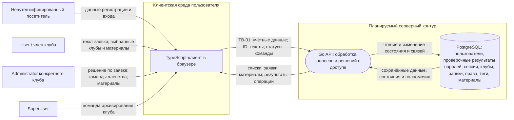

# Модель угроз сервиса клубного членства

Основания: [паспорт проекта](PROJECT.md) и [требования безопасности](SECURITY_REQUIREMENTS.md). Модель сформирована на S03 и уточнена на S04. Угрозы описывают потенциальные события в планируемом продукте, а не подтверждённые дефекты реализации.

## 1. Модель продукта

**Что уже существует:** согласованный паспорт и требования SR-01–SR-10. На момент объединения модели в этой ветке исходного кода сервера нет.

**Что пока планируется:** TypeScript-клиент, Go API, PostgreSQL, регистрация и вход, операции с клубами, заявками, членством и материалами. Точные маршруты и схема запросов ещё не выбраны. Для входа на S04 приняты серверная сессия (`D-01`) и хранение проверочного результата пароля (`D-04`) в [SECURITY_DESIGN.md](SECURITY_DESIGN.md). Имена полей ниже обозначают смысл данных, а не утверждённый API-контракт.

Внешние субъекты: неаутентифицированный посетитель, субъект с глобальной ролью User, член клуба, User с дополнительным полномочием Administrator конкретного клуба и субъект с глобальной ролью SuperUser. Administrator не заменяет роль User, поэтому администратор сохраняет базовые действия User. Тег `club-member` относится к паре «пользователь — клуб». SuperUser может архивировать клуб, но не создаёт клубы и заявки, а его роль сама по себе не даёт права читать материалы и заявки или управлять участниками и материалами.

**Существенные допущения:**

- Браузер и отправляемые им идентификаторы, тексты, статусы и команды недоверенны. Пользователь может сформировать прямой запрос в обход интерфейса; ID объекта может стать ему известен.
- API устанавливает действующего субъекта и решает допустимость операции. Сам факт входа не подтверждает право на конкретный объект.
- PostgreSQL хранит состояние клубов, связей и прав; прямого доступа пользователей к базе в планируемой модели нет. Это допущение о доступе к хранилищу, а не гарантия корректности всех сохранённых данных.
- Удаление клуба означает архивирование. Материалы, заявки, теги и права сохраняются, но прежние полномочия перестают давать доступ к материалам и управлению клубом.
- Название и описание активного клуба публичны; закрытым активом являются его материалы, а не название.
- Названия и описания клубов, тексты заявок и материалы в первой версии являются только текстом. HTML и Markdown не поддерживаются, а браузер не должен интерпретировать сохранённое значение как разметку или код.
- Оплата, внешние провайдеры, уведомления и загрузка файлов не входят в рассматриваемую версию. Самостоятельного журнала всех действий и восстановления архива в интерфейсе пока нет.

### Архитектурный вид

### Точки входа и потоки

| ID | Операция и входные данные | Значимый результат |
| --- | --- | --- |
| EP-01 | Регистрация и вход: учётные данные, данные регистрации, контекст входа | Учётная запись и установление действующего пользователя |
| EP-02 | Создание клуба: название, описание; возможные лишние ID в прямом запросе | Новый клуб, право администратора и членство создателя |
| EP-03 | Создание и просмотр заявки: ID клуба/заявки, текст; возможные подменённые владелец и статус | Новая заявка либо возврат её содержания и статуса |
| EP-04 | Рассмотрение заявки: ID заявки, решение approved/rejected | Статус, `administrator_id` и время решения; членство при одобрении |
| EP-05 | Управление членством: пользователь, клуб, действие | Добавление или удаление club-member конкретного клуба |
| EP-06 | Работа с материалами: ID клуба/материала, содержимое | Чтение, создание или изменение материала |
| EP-07 | Архивирование: ID клуба и команда удаления | Архивное состояние клуба, прекращение прежнего доступа |
| EP-08 | Профиль и списки: выбранные объекты, параметры запроса | Публичный список клубов и личные сведения пользователя |

## 2. Границы доверия

| Граница | Что пересекает | Почему требуется проверка |
| --- | --- | --- |
| TB-01: браузер → Go API | Учётные данные, контекст входа, ID объектов, тексты, статусы и команды | Клиент управляет запросом; скрытая кнопка, корректный формат ID и факт входа не доказывают допустимость операции |
| TB-02: установленный пользователь → операция с дополнительным полномочием | ID целевого клуба/объекта и команда управления либо архивирования | Внутри одного API меняется требуемое полномочие: пользователь не получает права Administrator любого клуба или SuperUser только из-за входа |

TB-02 — логическая граница полномочий, а не дополнительный сервис или сеть. Взаимодействие API с PostgreSQL показано на схеме; отдельная граница доступа к базе потребует уточнения после выбора развёртывания, пользователей БД и внешних подключений.

## 3. Значимые объекты и свойства

Подробные последствия описаны в [разделе 5 паспорта](PROJECT.md#5-значимые-данные-и-объекты). Для обхода потоков важны:

- идентичность пользователя и глобальная роль — подлинность субъекта и целостность полномочий;
- серверная сессия — конфиденциальность исходного bearer-токена, целостность привязки к пользователю и своевременное прекращение контекста входа;
- пароль и его сохранённый проверочный результат — конфиденциальность учётных данных и устойчивость к восстановлению после раскрытия хранилища;
- право администратора и тег club-member конкретного клуба — целостность связи «пользователь — клуб»;
- заявка — конфиденциальность содержания, целостность владельца, статуса и сведений о решении;
- материал — конфиденциальность, целостность содержимого и принадлежности клубу;
- состояние клуба — целостность, доступность законных функций и прекращение доступа после архивирования.

## 4. Угрозы

Каждый сценарий описывает нежелательное событие в планируемом продукте. Возможные слабости реализации не считаются установленными дефектами: способ обработки запросов ещё не выбран. STRIDE использован как вопросник для обхода потоков, а не как обязательная структура карточек.

### T-01 — Чтение материалов чужого клуба по идентификатору

**Сценарий:** участник клуба «Кино» подставляет ID материала клуба «Музыка», в котором не состоит, и получает его закрытое содержимое. Тот же результат возможен для SuperUser без членства в «Музыке».

- **Элемент модели:** TB-01, EP-06, Go API и хранилище материалов, клубов и тегов в PostgreSQL.
- **Актив:** закрытый материал клуба «Музыка».
- **Нарушаемое свойство:** конфиденциальность и соблюдение полномочий.
- **Последствие:** посторонний читает закрытый материал.
- **Статус:** релевантна.
- **Приоритет:** высокий.
- **Связанные SR:** [SR-01](SECURITY_REQUIREMENTS.md).
- **Причина решения:** чтение материалов — основной сценарий продукта; ID задаёт недоверенный клиент, а членство в одном клубе не даёт прав в другом. Один успешный запрос раскрывает содержимое.
- **Условие пересмотра:** материалы становятся публичными либо меняется модель доступа к ним.

### T-02 — Просмотр чужой заявки по идентификатору

**Сценарий:** обычный пользователь подставляет ID чужой заявки и получает её содержание или статус. Аналогичный запрос может сделать администратор другого клуба или SuperUser, у которого нет права читать эту заявку.

- **Элемент модели:** TB-01, EP-03, Go API и хранилище заявок.
- **Актив:** содержание и статус заявки кандидата.
- **Нарушаемое свойство:** конфиденциальность и соблюдение полномочий.
- **Последствие:** сведения кандидата раскрываются недопустимому получателю.
- **Статус:** релевантна.
- **Приоритет:** средний.
- **Связанные SR:** [SR-02](SECURITY_REQUIREMENTS.md).
- **Причина решения:** просмотр заявки предусмотрен продуктом, а её ID поступает от клиента. При текущем описании раскрывается отдельная заявка без непосредственной выдачи членства; чувствительность содержимого и массовая выдача пока не уточнены.
- **Условие пересмотра:** меняется чувствительность заявок, объём выдачи или круг разрешённых получателей.

### T-03 — Архивирование клуба с подменённым полномочием

**Сценарий:** обычный пользователь отправляет прямую команду архивирования клуба, указав в запросе роль SuperUser как свою. Команда выполняется от имени заявленной роли, и клуб исчезает из доступного списка для его участников.

- **Элемент модели:** TB-01, TB-02, EP-07, Go API и состояние клуба в PostgreSQL.
- **Актив:** активное состояние клуба и возможность участников пользоваться им.
- **Нарушаемое свойство:** подлинность полномочия, целостность и доступность.
- **Последствие:** клуб архивируется без решения SuperUser, участники теряют доступ к его функциям и материалам.
- **Статус:** релевантна.
- **Приоритет:** высокий.
- **Связанные SR:** [SR-03 и SR-09](SECURITY_REQUIREMENTS.md).
- **Причина решения:** операция удаления входит в продукт, а клиент может напрямую отправить команду и заявить роль. Одно ошибочно принятое действие затрагивает весь клуб. Отсутствие в штатном интерфейсе кнопки у User не исключает сценарий.
- **Условие пересмотра:** меняется право на архивирование либо способ установления действующего пользователя и роли.

### T-04 — Сохранённые права действуют после архивирования клуба

**Сценарий:** после архивирования клуба его сохранённые записи club-member и Administrator продолжают считаться действующими: бывший участник получает старый материал по ID, а бывший администратор выполняет команду управления этим клубом.

- **Элемент модели:** TB-01, для административных команд также TB-02; EP-04–EP-06; состояние клуба, теги и права в PostgreSQL.
- **Актив:** закрытые материалы и управляемое состояние архивного клуба.
- **Нарушаемое свойство:** конфиденциальность, целостность и прекращение полномочий.
- **Последствие:** данные архивного клуба читаются или меняются после прекращения доступа.
- **Статус:** релевантна.
- **Приоритет:** высокий.
- **Связанные SR:** [SR-03, SR-01, SR-04, SR-05 и SR-06](SECURITY_REQUIREMENTS.md).
- **Причина решения:** архивирование является штатной операцией, а связанные теги и права по паспорту сохраняются. Поэтому старые записи остаются доступными для последующего ошибочного решения о доступе.
- **Условие пересмотра:** меняется модель архива, связанные записи физически удаляются либо изолируются от обычных операций.

### T-05 — Решение по заявке чужого клуба

**Сценарий:** администратор клуба «Кино» подставляет ID ожидающей заявки клуба «Музыка» и одобряет её. Заявителю выдаётся club-member клуба «Музыка» без решения его администратора.

- **Элемент модели:** TB-01, TB-02, EP-04, Go API, заявка и запись членства в PostgreSQL.
- **Актив:** статус заявки и членство заявителя в клубе.
- **Нарушаемое свойство:** целостность решения и соблюдение клубных полномочий.
- **Последствие:** посторонний получает доступ к закрытым материалам клуба «Музыка».
- **Статус:** релевантна.
- **Приоритет:** высокий.
- **Связанные SR:** [SR-04](SECURITY_REQUIREMENTS.md).
- **Причина решения:** администратор работает с ID заявки, а одобрение непосредственно выдаёт право доступа. Повторное решение по уже закрытой заявке остаётся отдельным случаем критерия SR-04 для анализа при выборе реализации.
- **Условие пересмотра:** меняется порядок рассмотрения заявки или выдачи членства.

### T-06 — Изменение членства чужого клуба

**Сценарий:** администратор клуба «Кино» подставляет ID клуба «Музыка» в команду управления членством и выдаёт пользователю club-member «Музыки» без полномочия на этот клуб.

- **Элемент модели:** TB-01, TB-02, EP-05, Go API и хранилище тегов.
- **Актив:** club-member для пары «пользователь — клуб».
- **Нарушаемое свойство:** целостность членства и соблюдение полномочий.
- **Последствие:** пользователь без разрешения администратора «Музыки» получает доступ к её закрытым материалам.
- **Статус:** релевантна.
- **Приоритет:** высокий.
- **Связанные SR:** [SR-05](SECURITY_REQUIREMENTS.md).
- **Причина решения:** управление членством предусмотрено продуктом, ID целевого клуба приходит от клиента, а тег напрямую определяет доступ к материалам. Незаконное удаление тега — другой исход того же пути изменения членства и тоже предусмотрено SR-05.
- **Условие пересмотра:** меняется модель членства или круг управляющих им лиц.

### T-07 — Создание или изменение материала без полномочия клуба

**Сценарий:** администратор клуба «Кино» создаёт материал с `club_id` клуба «Музыка» либо подставляет ID существующего материала «Музыки» и сохраняет в нём другое содержимое. Тот же путь пытается использовать User или SuperUser без явного права Administrator этого клуба. В результате в «Музыке» появляется чужой либо подменённый материал.

- **Элемент модели:** TB-01, TB-02, EP-06, Go API и хранилище материалов.
- **Актив:** содержимое и принадлежность материала клубу.
- **Нарушаемое свойство:** целостность и соблюдение полномочий.
- **Последствие:** участники читают ложный материал от имени своего клуба.
- **Статус:** релевантна.
- **Приоритет:** высокий.
- **Связанные SR:** [SR-06](SECURITY_REQUIREMENTS.md).
- **Причина решения:** создание и редактирование материалов входят в продукт, а ID клуба и материала поступают из браузера. Ошибка затрагивает и достоверность содержимого, и принадлежность материала; гарантированное восстановление или история изменений в текущей границе не предусмотрены.
- **Условие пересмотра:** материалы становятся неизменяемыми либо появляется подтверждённый способ восстановления.

### T-08 — Права нового клуба получает другой пользователь

**Сценарий:** при создании клуба субъект с глобальной ролью User передаёт чужой ID как получателя Administrator и club-member. Новый клуб создаётся, но полномочия получает другой аккаунт, а создатель остаётся без ожидаемого доступа.

- **Элемент модели:** TB-01, EP-02, Go API и записи клуба, прав и тегов в PostgreSQL.
- **Актив:** полномочия создателя нового клуба и связь этих полномочий с клубом.
- **Нарушаемое свойство:** целостность и соблюдение полномочий.
- **Последствие:** другой пользователь управляет новым клубом; создатель не может использовать его штатно.
- **Статус:** релевантна.
- **Приоритет:** средний.
- **Связанные SR:** [SR-07](SECURITY_REQUIREMENTS.md).
- **Причина решения:** создание клуба одновременно назначает право и тег, а клиент может прислать посторонний ID. По текущей модели ущерб ограничен новым клубом; возможность назначить себя администратором существующего клуба не установлена.
- **Условие пересмотра:** в создании клуба появляется возможность указывать существующий клуб как получателя права или меняется порядок назначения полномочий.

### T-09 — Создание заявки с недопустимыми атрибутами или условиями

**Сценарий:** запрос создания заявки передаёт чужой ID владельца, начальный статус approved/rejected или ID архивного клуба либо исходит от SuperUser, действующего участника клуба или User с уже существующей pending-заявкой. В результате появляется заявка от имени другого человека, с ложным статусом, в неактивном клубе либо вопреки ролевому и предметному инварианту. Это варианты нарушения допустимого начального состояния одной операции.

- **Элемент модели:** TB-01, EP-03, Go API, заявки и состояние клубов в PostgreSQL.
- **Актив:** владелец, начальный статус, клуб и единственность новой заявки.
- **Нарушаемое свойство:** подлинность владельца и целостность исходного состояния заявки.
- **Последствие:** у другого человека появляется чужая заявка, фиксируется ложный статус, в архивном клубе возникают новые данные либо для участника или одной пары создаётся недопустимая заявка.
- **Статус:** релевантна.
- **Приоритет:** средний.
- **Связанные SR:** [SR-08](SECURITY_REQUIREMENTS.md); правило рассмотрения связано с SR-04, запрет действий в архиве — с SR-03.
- **Причина решения:** варианты относятся к одной операции и критерию SR-08. Глобальный User вправе выбрать клуб, но сервис должен проверить роль, активность клуба, отсутствие членства и pending-заявки и сам установить владельца и статус pending. Запись статуса approved сама по себе не выдаёт club-member: членство возникает при решении Administrator. При реализации каждый вариант проверяется отдельно.
- **Условие пересмотра:** меняется жизненный цикл заявки, выдача членства или обработка архивного клуба. Если реализация разделит варианты на разные потоки и решения, записать отдельные T с новыми ID.

### T-10 — Восстановление паролей из хранилища или журналов

**Сценарий:** при регистрации или входе сервис сохраняет либо журналирует пароль в открытом виде, с обратимым шифрованием или в виде быстрого хеша. После раскрытия базы или журналов злоумышленник восстанавливает пароль и захватывает аккаунт, в том числе аккаунт Administrator или SuperUser.

- **Элемент модели:** EP-01, Go API, журналы приложения и хранилище пользователей в PostgreSQL.
- **Актив:** пароль пользователя, его аккаунт и доступные аккаунту полномочия.
- **Нарушаемое свойство:** конфиденциальность учётных данных и подлинность последующих входов.
- **Последствие:** захват аккаунта, выполнение действий с его полномочиями и возможное использование того же пароля во внешних системах.
- **Статус:** релевантна.
- **Приоритет:** высокий.
- **Связанные SR:** [SR-10](SECURITY_REQUIREMENTS.md).
- **Причина решения:** вход по паролю входит в границу продукта, а хранилище и журналы могут быть раскрыты независимо от API. Официальная рекомендация OWASP требует стойкого специализированного хеширования паролей; для первой версии выбран Argon2id.
- **Внешний источник:** [OWASP Password Storage Cheat Sheet](https://cheatsheetseries.owasp.org/cheatsheets/Password_Storage_Cheat_Sheet.html).
- **Условие пересмотра:** вход по паролю полностью заменён внешним поставщиком идентификации и сервис больше не принимает и не хранит пароль.

## 5. Приоритетный набор

Для S04 выбраны **T-01, T-03, T-04, T-05, T-06, T-07 и T-10**: у этих семи угроз высокий приоритет по последствиям и реалистичности. Они охватывают раскрытие материалов, незаконное архивирование, сохранение старых прав, выдачу членства, изменение чужого содержимого и восстановление паролей после раскрытия хранилища. Одно проектное решение D может покрывать несколько угроз.

T-02, T-08 и T-09 остаются релевантными угрозами со средним приоритетом. Их карточки объясняют более узкие последствия и условия пересмотра.

## 6. Результаты проектирования S04

Приоритетный набор и связанные требования использованы как вход для решений `D-01`–`D-04` и будущих проверок в [SECURITY_DESIGN.md](SECURITY_DESIGN.md):

- **Установление субъекта:** `D-01` выбирает серверную сессию и запрещает клиенту задавать действующего пользователя или роль. Вместе с объектной авторизацией `D-02` это закрывает цепочку `T-03 → SR-03/SR-09`.
- **Заявки:** `D-03` задаёт однократный переход из `pending`, одну ожидающую заявку пользователя на клуб, атомарное сохранение решения и членства, а также согласование с архивированием клуба.
- **Создание клуба:** `D-03` запрещает клиенту задавать создателя и начальные полномочия и сохраняет клуб, право Administrator и `club-member` одной транзакцией.
- **Пароли:** `D-04` закрывает выявленный на S04 пробел цепочкой `T-10 → SR-10 → D-04`: открытый пароль не попадает в постоянное хранилище или журналы, а проверочный результат создаётся Argon2id.

После появления реализации необходимо повторно проверить фактические точки входа, выполнение принятого правила текстового отображения и условия доступа к архиву. Если продукту понадобится HTML, Markdown или другой rich text, потребуется отдельный пересмотр угроз, требований и решений до включения такого формата. Компрометация уже действующей сессии и массовое создание клубов или заявок пока не входят в зафиксированные сценарии; если модель развёртывания подтвердит их значимость, для них потребуются новые `T-*` с новыми ID.
